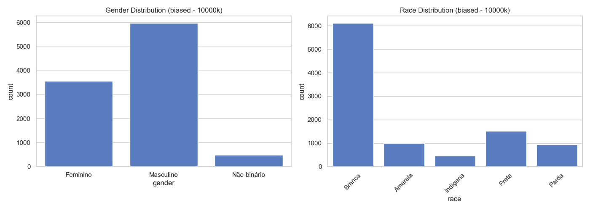
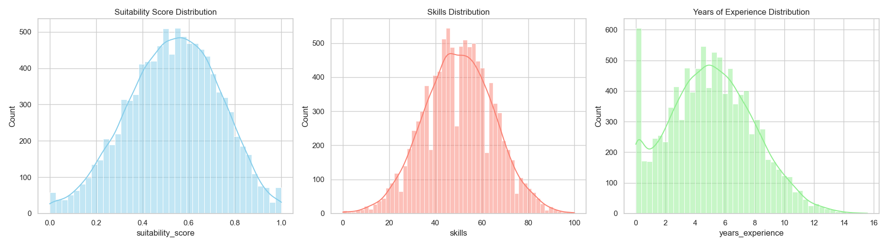
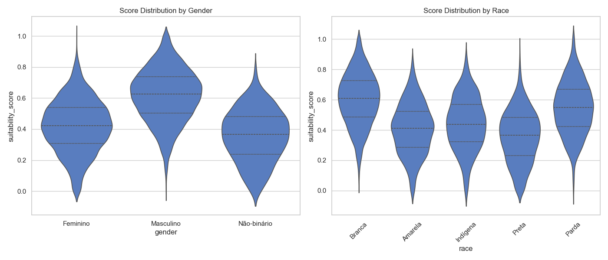
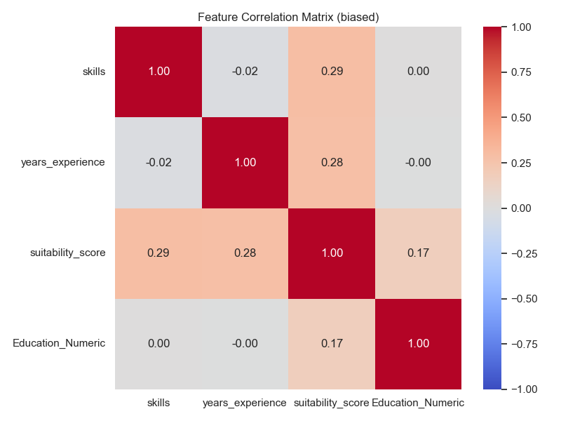

# Dataset Report: biased (10000 samples)

## Overview
- **Scenario**: biased
- **Size**: 10000
- **Overall Mean Score**: 0.5337

## Fairness & Diversity Metrics
| Metric | Gender | Race |
|---|---|---|
| Demographic Parity (Max Mean Diff) | 0.2594 | 0.2454 |
| Disparate Impact Ratio (Score > Mean) | 0.2265 | 0.2356 |
| Shannon Entropy (Diversity) | 0.8222 | 1.1787 |

## Descriptive Statistics by Group

### Gender
| gender | mean | std | min | 50% | max |
| --- | --- | --- | --- | --- | --- |
| Feminino | 0.4183 | 0.1713 | 0.0000 | 0.4230 | 1.0000 |
| Masculino | 0.6168 | 0.1703 | 0.0000 | 0.6259 | 1.0000 |
| Não-binário | 0.3574 | 0.1652 | 0.0000 | 0.3676 | 0.7927 |

### Race
| race | mean | std | min | 50% | max |
| --- | --- | --- | --- | --- | --- |
| Amarela | 0.4081 | 0.1695 | 0.0000 | 0.4120 | 0.8524 |
| Branca | 0.6026 | 0.1731 | 0.0470 | 0.6090 | 1.0000 |
| Indígena | 0.4436 | 0.1738 | 0.0000 | 0.4383 | 0.8765 |
| Parda | 0.5464 | 0.1742 | 0.0000 | 0.5480 | 1.0000 |
| Preta | 0.3573 | 0.1721 | 0.0000 | 0.3645 | 0.9264 |

## Visualizations

### 1. Demographic Distributions

### 2. Continuous Feature Distributions

### 3. Score Distribution by Demographic Group (Violin Plots)

### 4. Correlation Matrix

