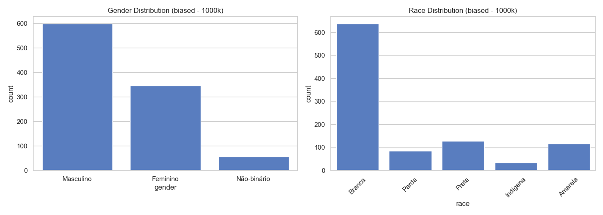
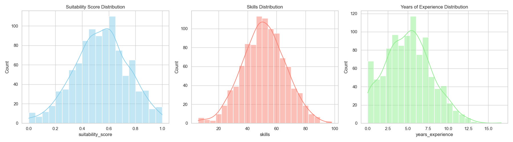
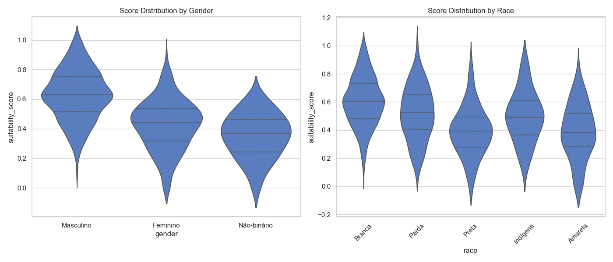
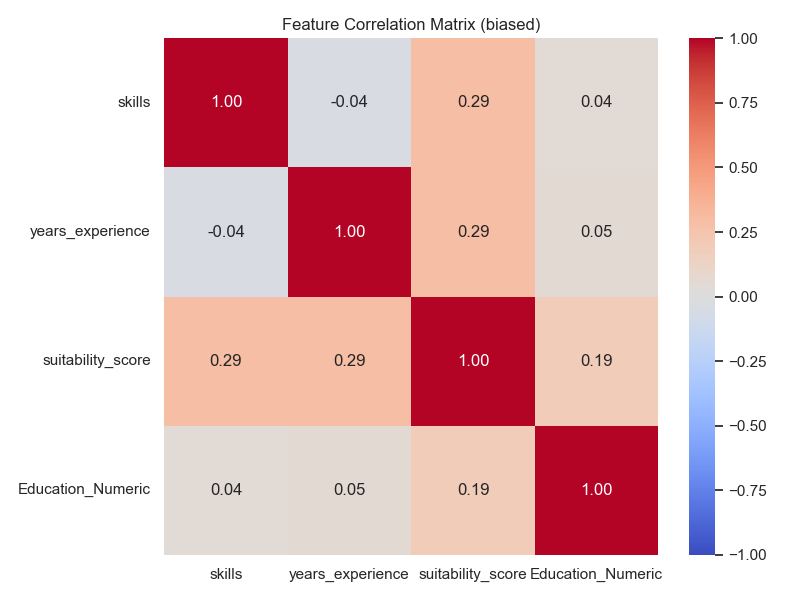

# Dataset Report: biased (1000 samples)

## Overview
- **Scenario**: biased
- **Size**: 1000
- **Overall Mean Score**: 0.5416

## Fairness & Diversity Metrics
| Metric | Gender | Race |
|---|---|---|
| Demographic Parity (Max Mean Diff) | 0.2756 | 0.2146 |
| Disparate Impact Ratio (Score > Mean) | 0.1265 | 0.2792 |
| Shannon Entropy (Diversity) | 0.8361 | 1.1248 |

## Descriptive Statistics by Group

### Gender
| gender | mean | std | min | 50% | max |
| --- | --- | --- | --- | --- | --- |
| Feminino | 0.4251 | 0.1717 | 0.0000 | 0.4421 | 0.9008 |
| Masculino | 0.6268 | 0.1714 | 0.0998 | 0.6285 | 1.0000 |
| Não-binário | 0.3512 | 0.1505 | 0.0000 | 0.3674 | 0.6193 |

### Race
| race | mean | std | min | 50% | max |
| --- | --- | --- | --- | --- | --- |
| Amarela | 0.3900 | 0.1956 | 0.0000 | 0.3837 | 0.8315 |
| Branca | 0.6047 | 0.1752 | 0.0802 | 0.6048 | 1.0000 |
| Indígena | 0.4977 | 0.1799 | 0.1403 | 0.4895 | 0.8628 |
| Parda | 0.5185 | 0.1875 | 0.1211 | 0.5260 | 0.9866 |
| Preta | 0.3920 | 0.1749 | 0.0000 | 0.3921 | 0.8956 |

## Visualizations

### 1. Demographic Distributions

### 2. Continuous Feature Distributions

### 3. Score Distribution by Demographic Group (Violin Plots)

### 4. Correlation Matrix

