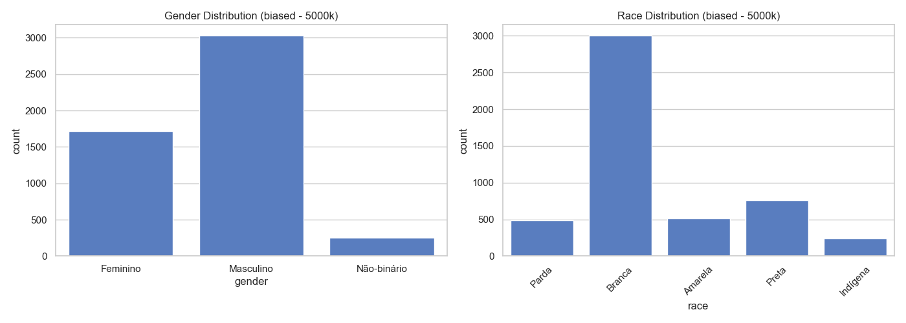
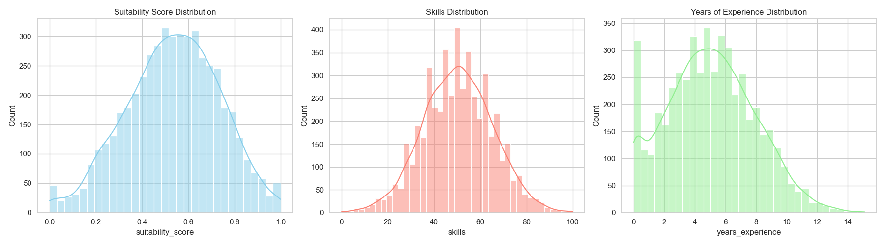
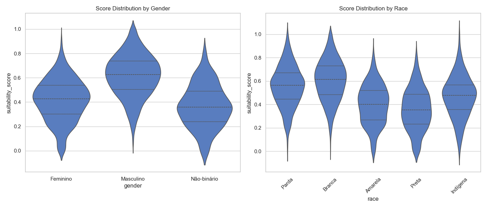
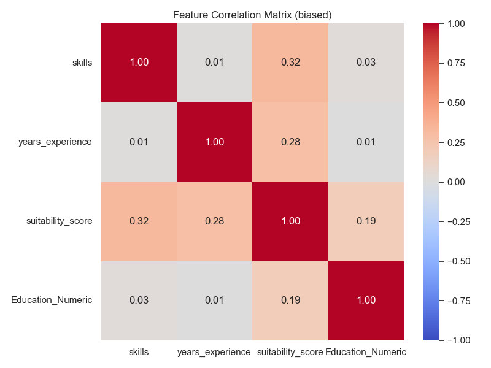

# Dataset Report: biased (5000 samples)

## Overview
- **Scenario**: biased
- **Size**: 5000
- **Overall Mean Score**: 0.5352

## Fairness & Diversity Metrics
| Metric | Gender | Race |
|---|---|---|
| Demographic Parity (Max Mean Diff) | 0.2503 | 0.2462 |
| Disparate Impact Ratio (Score > Mean) | 0.2710 | 0.2415 |
| Shannon Entropy (Diversity) | 0.8232 | 1.2000 |

## Descriptive Statistics by Group

### Gender
| gender | mean | std | min | 50% | max |
| --- | --- | --- | --- | --- | --- |
| Feminino | 0.4168 | 0.1727 | 0.0000 | 0.4261 | 0.9340 |
| Masculino | 0.6167 | 0.1742 | 0.0512 | 0.6260 | 1.0000 |
| Não-binário | 0.3664 | 0.1755 | 0.0000 | 0.3581 | 0.8108 |

### Race
| race | mean | std | min | 50% | max |
| --- | --- | --- | --- | --- | --- |
| Amarela | 0.3984 | 0.1695 | 0.0000 | 0.3993 | 0.8675 |
| Branca | 0.6051 | 0.1761 | 0.0000 | 0.6129 | 1.0000 |
| Indígena | 0.4675 | 0.1749 | 0.0000 | 0.4760 | 1.0000 |
| Parda | 0.5564 | 0.1720 | 0.0149 | 0.5647 | 1.0000 |
| Preta | 0.3589 | 0.1775 | 0.0000 | 0.3524 | 0.8467 |

## Visualizations

### 1. Demographic Distributions

### 2. Continuous Feature Distributions

### 3. Score Distribution by Demographic Group (Violin Plots)

### 4. Correlation Matrix

