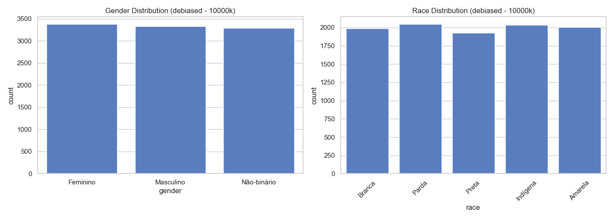
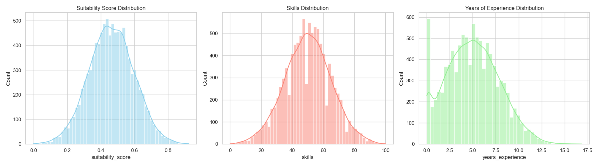
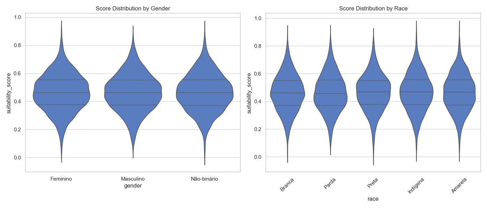
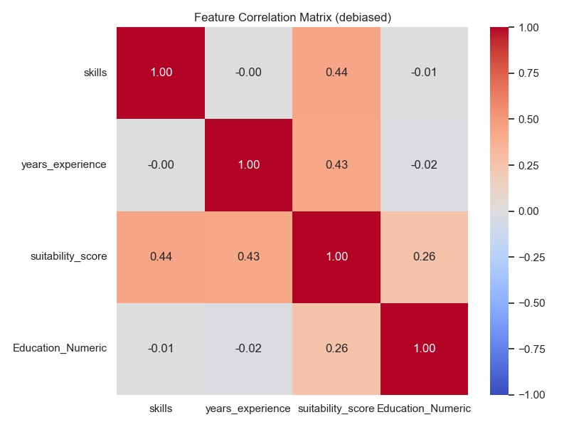

# Dataset Report: debiased (10000 samples)

## Overview
- **Scenario**: debiased
- **Size**: 10000
- **Overall Mean Score**: 0.4637

## Fairness & Diversity Metrics
| Metric | Gender | Race |
|---|---|---|
| Demographic Parity (Max Mean Diff) | 0.0016 | 0.0046 |
| Disparate Impact Ratio (Score > Mean) | 0.9946 | 0.9357 |
| Shannon Entropy (Diversity) | 1.0986 | 1.6092 |

## Descriptive Statistics by Group

### Gender
| gender | mean | std | min | 50% | max |
| --- | --- | --- | --- | --- | --- |
| Feminino | 0.4643 | 0.1337 | 0.0180 | 0.4639 | 0.9240 |
| Masculino | 0.4627 | 0.1336 | 0.0490 | 0.4627 | 0.8866 |
| Não-binário | 0.4641 | 0.1341 | 0.0000 | 0.4637 | 0.9214 |

### Race
| race | mean | std | min | 50% | max |
| --- | --- | --- | --- | --- | --- |
| Amarela | 0.4646 | 0.1338 | 0.0251 | 0.4645 | 0.9240 |
| Branca | 0.4612 | 0.1330 | 0.0180 | 0.4607 | 0.8890 |
| Indígena | 0.4659 | 0.1358 | 0.0269 | 0.4671 | 0.9214 |
| Parda | 0.4621 | 0.1343 | 0.0721 | 0.4563 | 0.8925 |
| Preta | 0.4647 | 0.1319 | 0.0000 | 0.4676 | 0.8689 |

## Visualizations

### 1. Demographic Distributions

### 2. Continuous Feature Distributions

### 3. Score Distribution by Demographic Group (Violin Plots)

### 4. Correlation Matrix

