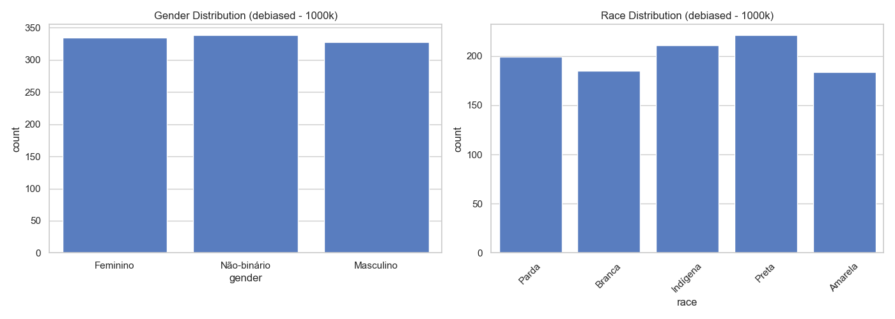
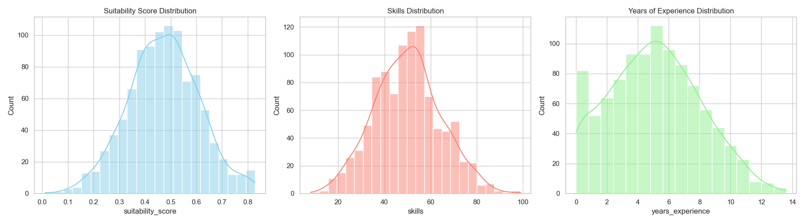
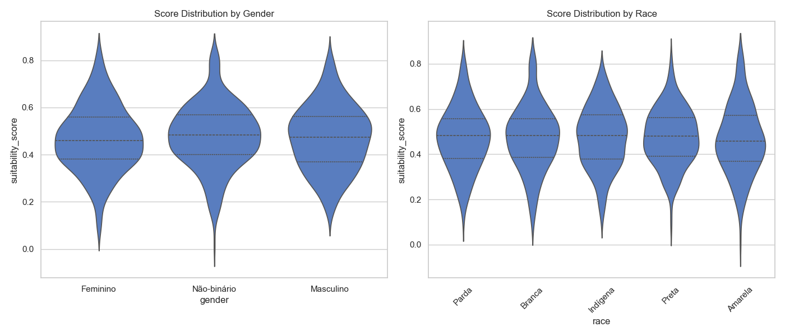
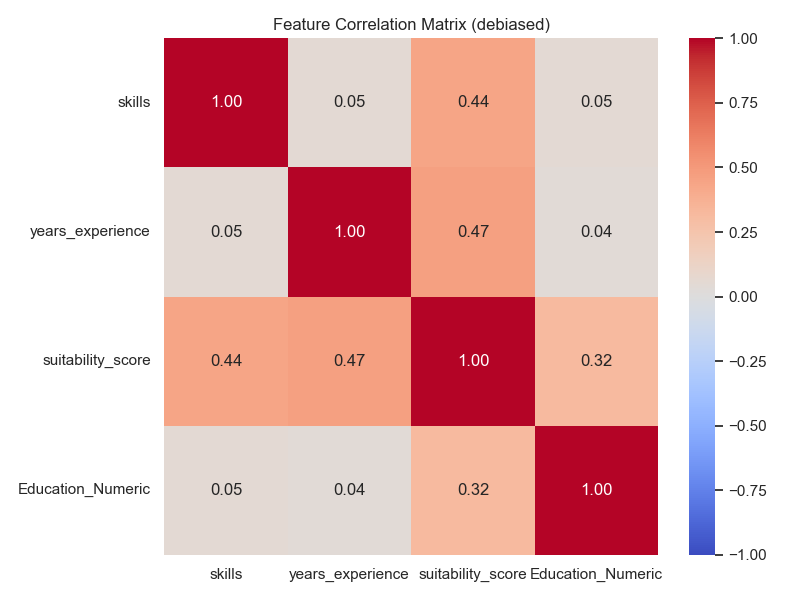

# Dataset Report: debiased (1000 samples)

## Overview
- **Scenario**: debiased
- **Size**: 1000
- **Overall Mean Score**: 0.4724

## Fairness & Diversity Metrics
| Metric | Gender | Race |
|---|---|---|
| Demographic Parity (Max Mean Diff) | 0.0108 | 0.0116 |
| Disparate Impact Ratio (Score > Mean) | 0.8827 | 0.8368 |
| Shannon Entropy (Diversity) | 1.0985 | 1.6068 |

## Descriptive Statistics by Group

### Gender
| gender | mean | std | min | 50% | max |
| --- | --- | --- | --- | --- | --- |
| Feminino | 0.4680 | 0.1392 | 0.0801 | 0.4605 | 0.8277 |
| Masculino | 0.4703 | 0.1372 | 0.1424 | 0.4747 | 0.8147 |
| Não-binário | 0.4788 | 0.1357 | 0.0111 | 0.4837 | 0.8285 |

### Race
| race | mean | std | min | 50% | max |
| --- | --- | --- | --- | --- | --- |
| Amarela | 0.4658 | 0.1520 | 0.0111 | 0.4581 | 0.8285 |
| Branca | 0.4715 | 0.1425 | 0.0983 | 0.4820 | 0.8163 |
| Indígena | 0.4748 | 0.1341 | 0.1223 | 0.4837 | 0.7665 |
| Parda | 0.4715 | 0.1369 | 0.1102 | 0.4820 | 0.8096 |
| Preta | 0.4773 | 0.1238 | 0.0801 | 0.4793 | 0.8277 |

## Visualizations

### 1. Demographic Distributions

### 2. Continuous Feature Distributions

### 3. Score Distribution by Demographic Group (Violin Plots)

### 4. Correlation Matrix

