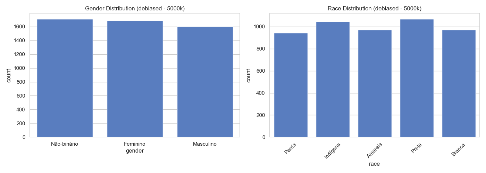
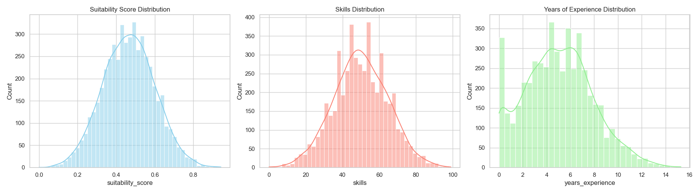
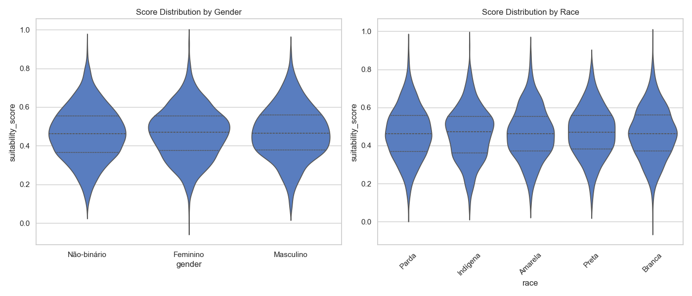
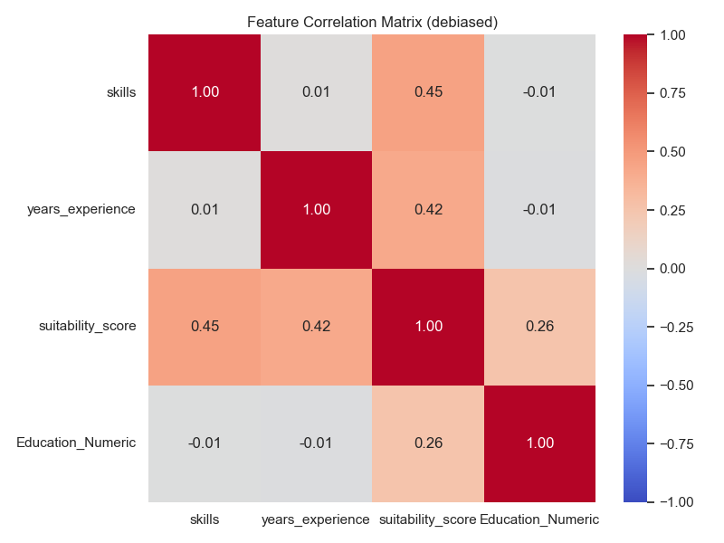

# Dataset Report: debiased (5000 samples)

## Overview
- **Scenario**: debiased
- **Size**: 5000
- **Overall Mean Score**: 0.4655

## Fairness & Diversity Metrics
| Metric | Gender | Race |
|---|---|---|
| Demographic Parity (Max Mean Diff) | 0.0055 | 0.0070 |
| Disparate Impact Ratio (Score > Mean) | 0.9490 | 0.9433 |
| Shannon Entropy (Diversity) | 1.0983 | 1.6083 |

## Descriptive Statistics by Group

### Gender
| gender | mean | std | min | 50% | max |
| --- | --- | --- | --- | --- | --- |
| Feminino | 0.4666 | 0.1317 | 0.0000 | 0.4695 | 0.9429 |
| Masculino | 0.4678 | 0.1360 | 0.0768 | 0.4640 | 0.9023 |
| Não-binário | 0.4622 | 0.1363 | 0.0847 | 0.4611 | 0.9172 |

### Race
| race | mean | std | min | 50% | max |
| --- | --- | --- | --- | --- | --- |
| Amarela | 0.4647 | 0.1356 | 0.0896 | 0.4619 | 0.9023 |
| Branca | 0.4657 | 0.1343 | 0.0000 | 0.4622 | 0.9429 |
| Indígena | 0.4623 | 0.1368 | 0.0782 | 0.4717 | 0.9285 |
| Parda | 0.4653 | 0.1360 | 0.0694 | 0.4614 | 0.9172 |
| Preta | 0.4692 | 0.1309 | 0.0828 | 0.4702 | 0.8384 |

## Visualizations

### 1. Demographic Distributions

### 2. Continuous Feature Distributions

### 3. Score Distribution by Demographic Group (Violin Plots)

### 4. Correlation Matrix

