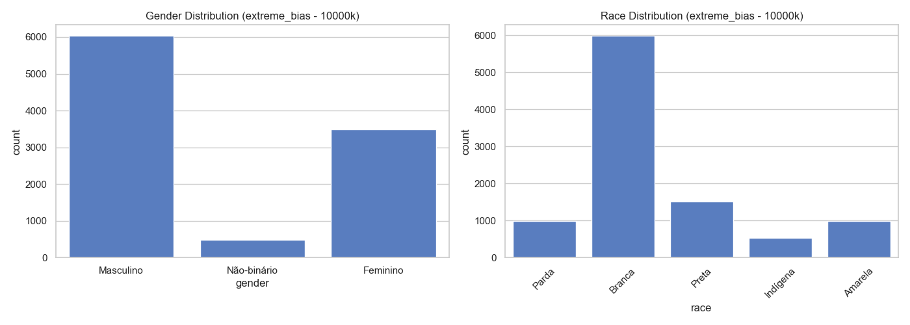
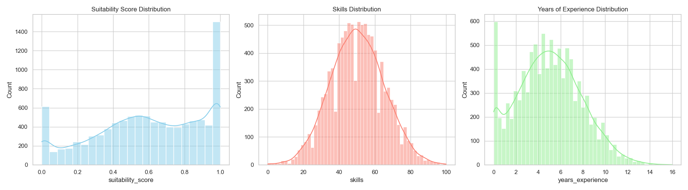
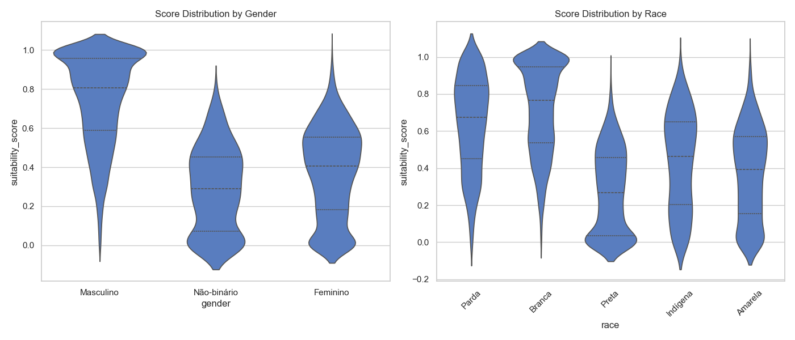
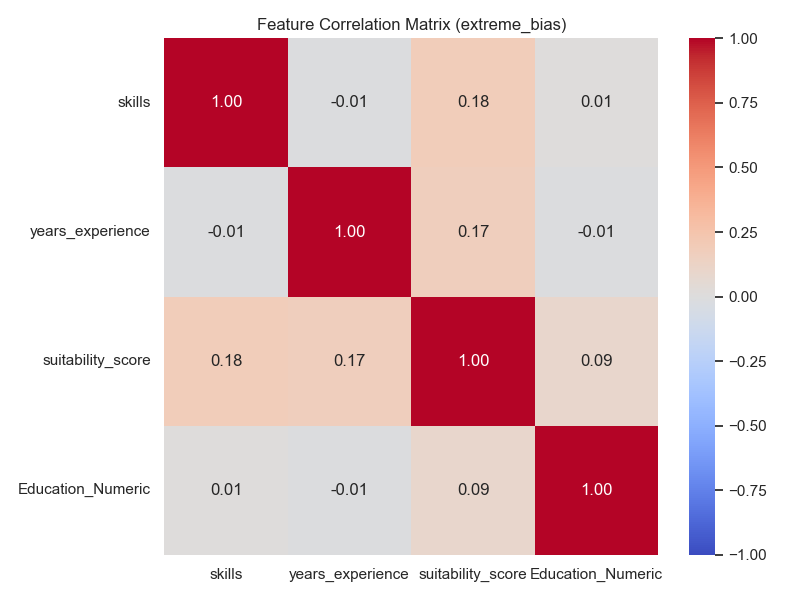

# Dataset Report: extreme_bias (10000 samples)

## Overview
- **Scenario**: extreme_bias
- **Size**: 10000
- **Overall Mean Score**: 0.5949

## Fairness & Diversity Metrics
| Metric | Gender | Race |
|---|---|---|
| Demographic Parity (Max Mean Diff) | 0.4618 | 0.4497 |
| Disparate Impact Ratio (Score > Mean) | 0.1032 | 0.1193 |
| Shannon Entropy (Diversity) | 0.8190 | 1.2066 |

## Descriptive Statistics by Group

### Gender
| gender | mean | std | min | 50% | max |
| --- | --- | --- | --- | --- | --- |
| Feminino | 0.3734 | 0.2311 | 0.0000 | 0.4051 | 0.9939 |
| Masculino | 0.7480 | 0.2331 | 0.0000 | 0.8072 | 1.0000 |
| Não-binário | 0.2862 | 0.2133 | 0.0000 | 0.2891 | 0.7964 |

### Race
| race | mean | std | min | 50% | max |
| --- | --- | --- | --- | --- | --- |
| Amarela | 0.3686 | 0.2427 | 0.0000 | 0.3918 | 0.9778 |
| Branca | 0.7209 | 0.2400 | 0.0000 | 0.7671 | 1.0000 |
| Indígena | 0.4370 | 0.2577 | 0.0000 | 0.4645 | 0.9573 |
| Parda | 0.6401 | 0.2508 | 0.0000 | 0.6740 | 1.0000 |
| Preta | 0.2712 | 0.2225 | 0.0000 | 0.2683 | 0.9056 |

## Visualizations

### 1. Demographic Distributions

### 2. Continuous Feature Distributions

### 3. Score Distribution by Demographic Group (Violin Plots)

### 4. Correlation Matrix

