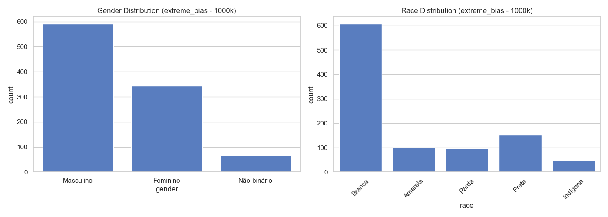
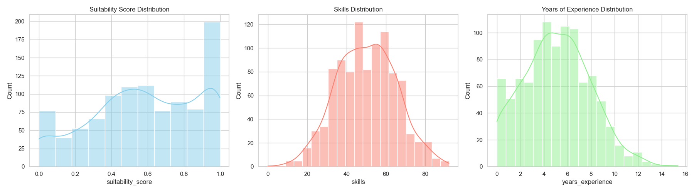
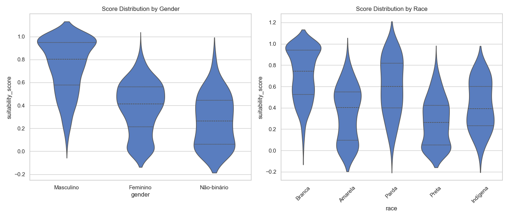
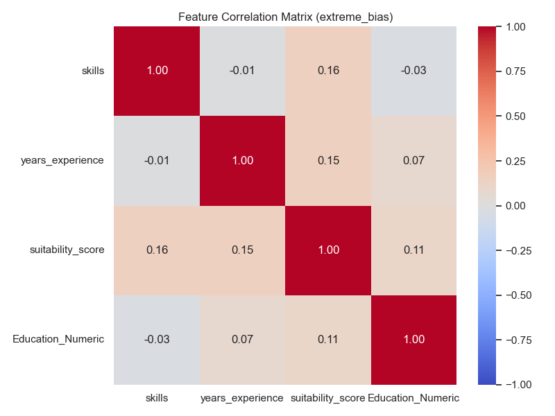

# Dataset Report: extreme_bias (1000 samples)

## Overview
- **Scenario**: extreme_bias
- **Size**: 1000
- **Overall Mean Score**: 0.5857

## Fairness & Diversity Metrics
| Metric | Gender | Race |
|---|---|---|
| Demographic Parity (Max Mean Diff) | 0.4720 | 0.4425 |
| Disparate Impact Ratio (Score > Mean) | 0.1012 | 0.1276 |
| Shannon Entropy (Diversity) | 0.8594 | 1.1872 |

## Descriptive Statistics by Group

### Gender
| gender | mean | std | min | 50% | max |
| --- | --- | --- | --- | --- | --- |
| Feminino | 0.3786 | 0.2221 | 0.0000 | 0.4142 | 0.8988 |
| Masculino | 0.7419 | 0.2343 | 0.0731 | 0.8026 | 1.0000 |
| Não-binário | 0.2699 | 0.2172 | 0.0000 | 0.2635 | 0.8037 |

### Race
| race | mean | std | min | 50% | max |
| --- | --- | --- | --- | --- | --- |
| Amarela | 0.3492 | 0.2476 | 0.0000 | 0.4038 | 0.8584 |
| Branca | 0.7135 | 0.2390 | 0.0000 | 0.7430 | 1.0000 |
| Indígena | 0.4236 | 0.2212 | 0.0000 | 0.3918 | 0.7734 |
| Parda | 0.5998 | 0.2603 | 0.0000 | 0.5986 | 1.0000 |
| Preta | 0.2711 | 0.2171 | 0.0000 | 0.2626 | 0.8226 |

## Visualizations

### 1. Demographic Distributions

### 2. Continuous Feature Distributions

### 3. Score Distribution by Demographic Group (Violin Plots)

### 4. Correlation Matrix

