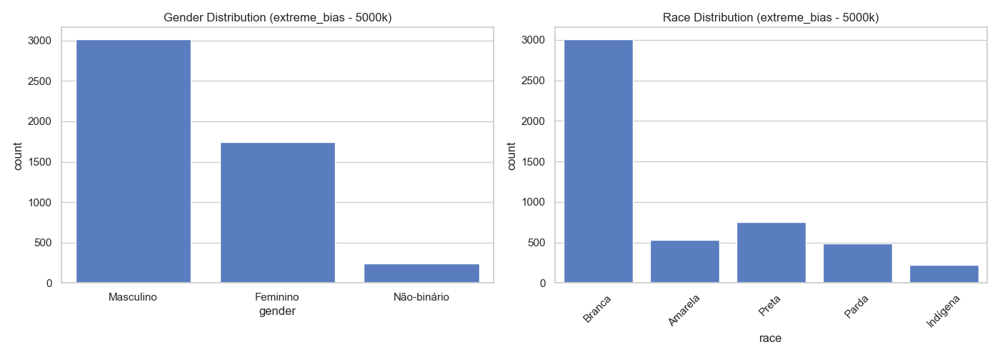
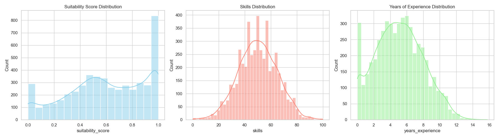
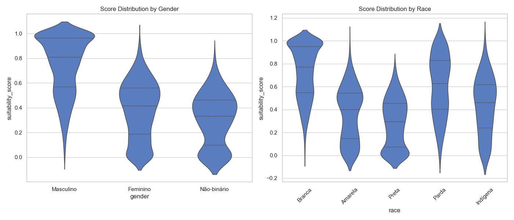
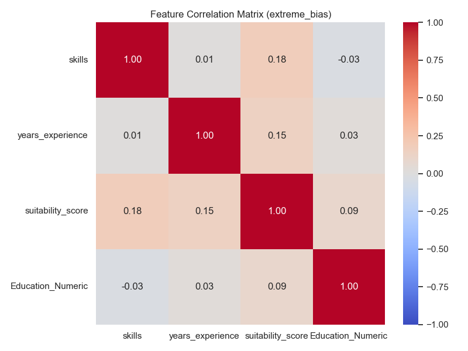

# Dataset Report: extreme_bias (5000 samples)

## Overview
- **Scenario**: extreme_bias
- **Size**: 5000
- **Overall Mean Score**: 0.5979

## Fairness & Diversity Metrics
| Metric | Gender | Race |
|---|---|---|
| Demographic Parity (Max Mean Diff) | 0.4423 | 0.4491 |
| Disparate Impact Ratio (Score > Mean) | 0.0844 | 0.0936 |
| Shannon Entropy (Diversity) | 0.8210 | 1.1967 |

## Descriptive Statistics by Group

### Gender
| gender | mean | std | min | 50% | max |
| --- | --- | --- | --- | --- | --- |
| Feminino | 0.3822 | 0.2308 | 0.0000 | 0.4145 | 0.9655 |
| Masculino | 0.7468 | 0.2353 | 0.0000 | 0.8072 | 1.0000 |
| Não-binário | 0.3045 | 0.2078 | 0.0000 | 0.3320 | 0.8046 |

### Race
| race | mean | std | min | 50% | max |
| --- | --- | --- | --- | --- | --- |
| Amarela | 0.3587 | 0.2339 | 0.0000 | 0.3998 | 0.9915 |
| Branca | 0.7301 | 0.2341 | 0.0000 | 0.7709 | 1.0000 |
| Indígena | 0.4327 | 0.2462 | 0.0000 | 0.4603 | 1.0000 |
| Parda | 0.6076 | 0.2633 | 0.0000 | 0.6256 | 1.0000 |
| Preta | 0.2810 | 0.2121 | 0.0000 | 0.2920 | 0.7728 |

## Visualizations

### 1. Demographic Distributions

### 2. Continuous Feature Distributions

### 3. Score Distribution by Demographic Group (Violin Plots)

### 4. Correlation Matrix

